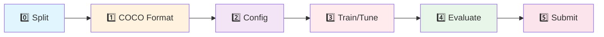

알겠습니다! Notion 문서들을 기반으로 GenSpark AI Developer가 읽기 좋은 README를 작성해드릴게요. 프로젝트 구조와 워크플로우가 명확하게 정리되어 있네요!

---

# 🏥 Healthcare AI Project - YOLO 기반 의료 이미지 객체 탐지

> **AI-powered Healthcare Image Analysis System**  
> YOLO 모델을 활용한 의료 이미지 객체 탐지 및 분류 프로젝트

[](https://www.python.org/)
[](https://pytorch.org/)
[](https://github.com/ultralytics/ultralytics)

---

## 📋 프로젝트 개요

본 프로젝트는 의료 이미지 데이터셋을 활용하여 YOLO 기반 객체 탐지 모델을 개발하고, Kaggle 제출 및 성능 평가를 진행하는 MLOps-aware 프로젝트입니다.

### 🎯 주요 목표
- COCO 포맷 기반 의료 이미지 전처리 파이프라인 구축
- YOLO 모델 학습 및 하이퍼파라미터 튜닝
- 실험 관리 및 재현성 확보 (W&B 통합)
- Kaggle 제출 자동화 및 성능 트래킹

### 📊 데이터셋 정보
- **Train Images**: 232개
- **Train Annotations**: 114개 폴더 (763개 JSON 파일)
- **Test Images**: 842개 (Kaggle 제출용)

---

## 🗂️ 프로젝트 구조

```
pjt-sprint_ai07_healthcare/
├── README.md                          # 📖 이 문서
├── requirements.txt                   # 📦 의존성 패키지
├── .gitignore
│
├── data/                              # 💾 데이터 관리
│   ├── raw/                          # ✅ 원본 데이터 (Git 제외, 절대 수정 금지)
│   │   ├── train_images/             # 232개 이미지
│   │   ├── train_annotations/        # 763개 JSON 파일
│   │   └── test_images/              # 842개 테스트 이미지
│   │
│   ├── splits/                       # ✅ STAGE 0: 데이터 분할 결과
│   │   ├── train_split/
│   │   ├── val_split/
│   │   └── test_split/               # (선택) 최종 평가용
│   │
│   └── coco_data/                    # ✅ STAGE 1: COCO 포맷 변환 결과
│       ├── train_coco.json
│       ├── val_coco.json
│       └── meta/
│           ├── class_mapping.json
│           └── dataset_stats.json
│
├── configs/                          # ⚙️ 실험 설정 (YAML)
│   ├── base.yaml                     # 공통 기본 설정
│   └── experiments/
│       ├── exp001_baseline.yaml
│       ├── exp002_augmentation.yaml
│       └── exp003_larger_model.yaml
│
├── src/                              # 🧩 핵심 모듈 (MVP: 평면 구조)
│   ├── __init__.py
│   ├── data_loader.py                # COCO 로드 + DataLoader
│   ├── model.py                      # YOLO 래퍼/모델 생성
│   ├── train_loop.py                 # Train/Validate 루프
│   ├── infer.py                      # Inference 함수
│   └── utils.py                      # Config load, logger, seed, IO
│
├── scripts/                          # 🚀 실행 엔트리 포인트 (6단계 워크플로우)
│   ├── splitting.py                  # STAGE 0: 데이터 분할
│   ├── create_coco_format.py         # STAGE 1: COCO JSON 생성
│   ├── train.py                      # STAGE 3: 모델 학습/튜닝
│   ├── evaluate.py                   # STAGE 4: 평가 (mAP 등)
│   └── submission.py                 # STAGE 5: submission.csv 생성
│
├── notebooks/                        # 📓 EDA & 분석
│   ├── 01_eda.ipynb                  # 탐색적 데이터 분석
│   └── 02_error_analysis.ipynb       # 오류 분석
│
├── runs/                             # 📊 실험 결과 (Git 제외)
│   ├── exp_20260204_102745/          # 타임스탬프 기반 실험 폴더
│   │   ├── checkpoints/
│   │   │   ├── best.pt
│   │   │   └── last.pt
│   │   ├── logs/
│   │   │   ├── train.log
│   │   │   └── metrics.jsonl
│   │   ├── eval/                     # 평가 결과
│   │   │   ├── metrics.json
│   │   │   ├── confusion_matrix.png
│   │   │   └── summary.md
│   │   ├── config_snapshot/          # 재현성: 실제 사용 config
│   │   │   ├── base.yaml
│   │   │   └── exp.yaml
│   │   └── plots/
│   │       ├── pr_curve.png
│   │       └── results.png
│   └── _registry.csv                 # 실험 목록 (선택)
│
├── artifacts/                        # 🏆 최종 산출물 (Git 제외)
│   ├── best_models/                  # 최고 성능 모델
│   │   ├── best.pt
│   │   ├── best_config.yaml
│   │   └── best_metrics.json
│   └── submissions/
│       ├── submission_best.csv       # 최종 제출
│       └── submission_try_*.csv      # 제출 시도 기록
│
└── docs/
    ├── SETUP.md                      # 환경 설정 가이드
    └── WORKFLOW.md                   # 팀 규칙 & Guard 룰
```

---

## 🔄 워크플로우 (6단계)



### STAGE 0️⃣: 데이터 분할 (Data Splitting)
```bash
python scripts/splitting.py \
  --raw_dir data/raw \
  --out_dir data/splits \
  --train_ratio 0.8 \
  --val_ratio 0.2 \
  --seed 42
```

**입력**: `data/raw/train_images/`, `data/raw/train_annotations/`  
**출력**: `data/splits/train_split/`, `data/splits/val_split/`

> 💡 **Tip**: 이미지를 실제로 복사하지 말고 `images.txt` 같은 manifest 파일로 관리하세요!

---

### STAGE 1️⃣: COCO 포맷 변환
```bash
python scripts/create_coco_format.py \
  --split_dir data/splits \
  --anno_dir data/raw/train_annotations \
  --out_dir data/coco_data \
  --seed 42
```

**입력**: Split 결과 + 원본 annotations  
**출력**: `train_coco.json`, `val_coco.json`, `class_mapping.json`

---

### STAGE 2️⃣: 설정 파일 준비
```yaml
# configs/experiments/exp001_baseline.yaml
parent: configs/base.yaml

experiment:
  name: "exp001_baseline"
  description: "Baseline YOLO model"

model:
  name: "yolov8n"
  pretrained: true

training:
  epochs: 50
  batch_size: 16
  optimizer: "AdamW"
  lr: 0.001
```

---

### STAGE 3️⃣: 모델 학습
```bash
python scripts/train.py \
  --config configs/experiments/exp001_baseline.yaml \
  --data_dir data/coco_data \
  --output_dir runs \
  --wandb_project healthcare-yolo
```

**주요 기능**:
- W&B 통합 실험 트래킹
- Config snapshot 자동 저장 (재현성)
- Best/Last checkpoint 저장

---

### STAGE 4️⃣: 모델 평가
```bash
python scripts/evaluate.py \
  --checkpoint runs/exp_20260204_102745/checkpoints/best.pt \
  --data_path data/coco_data/val_coco.json \
  --output_dir runs/exp_20260204_102745/eval
```

**평가 지표**:
- mAP@0.5, mAP@0.5:0.95
- Precision, Recall
- Confusion Matrix
- PR Curve

---

### STAGE 5️⃣: Kaggle 제출
```bash
python scripts/submission.py \
  --checkpoint artifacts/best_models/best.pt \
  --test_dir data/raw/test_images \
  --output artifacts/submissions/submission_$(date +%Y%m%d_%H%M%S).csv
```

**출력 포맷**:
```csv
image_id,class_id,confidence,xmin,ymin,xmax,ymax
test_001,0,0.95,100,150,300,400
```

---

## 🚀 빠른 시작 (Quick Start)

### 1️⃣ 환경 설정
```bash
# 저장소 클론
git clone https://github.com/ming2tofu33/pjt-sprint_ai07_healthcare.git
cd pjt-sprint_ai07_healthcare

# 가상환경 생성 (권장)
python -m venv venv
source venv/bin/activate  # Windows: venv\Scripts\activate

# 의존성 설치
pip install -r requirements.txt
```

### 2️⃣ 데이터 준비
```bash
# data/raw/ 폴더에 데이터 다운로드
# - train_images/
# - train_annotations/
# - test_images/

# 데이터 분할
python scripts/splitting.py --raw_dir data/raw --out_dir data/splits

# COCO 포맷 변환
python scripts/create_coco_format.py \
  --split_dir data/splits \
  --anno_dir data/raw/train_annotations \
  --out_dir data/coco_data
```

### 3️⃣ Baseline 학습
```bash
python scripts/train.py \
  --config configs/experiments/exp001_baseline.yaml \
  --data_dir data/coco_data
```

### 4️⃣ 평가 및 제출
```bash
# 평가
python scripts/evaluate.py \
  --checkpoint runs/<experiment_name>/checkpoints/best.pt \
  --data_path data/coco_data/val_coco.json

# Kaggle 제출 파일 생성
python scripts/submission.py \
  --checkpoint runs/<experiment_name>/checkpoints/best.pt \
  --test_dir data/raw/test_images
```

---

## 📈 실험 관리

### W&B 통합
```bash
# 환경 변수 설정
export WANDB_API_KEY=<your_api_key>
export WANDB_PROJECT=healthcare-yolo

# 학습 시 자동 로깅
python scripts/train.py --config <config_file> --wandb_project healthcare-yolo
```

### 실험 비교
```bash
# runs/_registry.csv 확인
cat runs/_registry.csv

# 또는 W&B Dashboard 사용
# https://wandb.ai/<username>/healthcare-yolo
```

---

## 🛠️ 개발 가이드

### 코드 스타일
- **Formatter**: Black
- **Linter**: Flake8
- **Type Checking**: MyPy (선택)

```bash
# 포맷팅
black src/ scripts/

# 린팅
flake8 src/ scripts/
```

### 브랜치 전략
- `main`: 안정 버전
- `develop`: 개발 통합 브랜치
- `feature/<name>`: 기능 개발
- `experiment/<name>`: 실험용 브랜치

### Guard 룰 (중요!)
1. **절대 `data/raw/` 수정 금지**
2. **Config는 YAML로 관리** (하드코딩 금지)
3. **실험 결과는 `runs/` 에만 저장**
4. **재현성 확보**: seed 고정, config snapshot 저장
5. **Commit 전 포맷팅 확인**

---

## 📅 프로젝트 타임라인

| 주차 | 기간 | 주요 작업 |
|------|------|----------|
| Week 1 | 1/28 ~ 2/1 | 셋업, EDA, 전처리 전략 수립 |
| Week 2 | 2/2 ~ 2/8 | Baseline 구현, 모델 튜닝, 첫 제출 |
| Week 3 | 2/9 ~ 2/15 | 앙상블, XAI(Grad-CAM), 리팩토링 |
| Week 4 | 2/16 ~ 2/23 | 최종 제출 (2/20), 발표 (2/23) |

> **현재 진행 상황**: Week 2 (Baseline 학습 및 튜닝 단계) ✅

---

## 🤝 팀 구성 & R&R

| Name	| Role |	Sub Role |
|------|------|-----------|
| 김도민 |	Project Manager |	Model Architect |
| 안뜰에봄 | Data Engineer	| Project Manager |
| 서지은	| Model Architect	| Data Engineer |
| 김준혁	| Experimentation Lead |	FE & Presentation |
| 이건호 |	FE & Presentation	| Model Architect |

---

## 📚 참고 자료

- [YOLO Official Docs](https://docs.ultralytics.com/)
- [COCO Format Specification](https://cocodataset.org/#format-data)
- [W&B Documentation](https://docs.wandb.ai/)

---

## 📝 라이센스

이 프로젝트는 MIT 라이센스 하에 배포됩니다.

---

## 📧 문의

프로젝트 관련 문의사항은 Issue를 등록해주세요.

**Team Healthcare AI** 🏥  
*Building the future of medical image analysis*