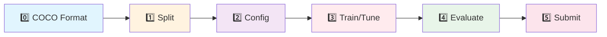

# 🏥 Healthcare AI Project - YOLO 기반 의료 이미지 객체 탐지

> **AI-powered Healthcare Image Analysis System**  
> YOLO 모델을 활용한 의료 이미지 객체 탐지 및 분류 프로젝트

[](https://www.python.org/)
[](https://pytorch.org/)
[](https://github.com/ultralytics/ultralytics)

---

## 📋 프로젝트 개요

본 프로젝트는 의료 이미지 데이터셋을 활용하여 YOLO 기반 객체 탐지 모델을 개발하고, Kaggle 제출 및 성능 평가를 진행하는 MLOps-aware 프로젝트입니다.

### 🎯 주요 목표
- COCO 포맷 기반 의료 이미지 전처리 파이프라인 구축
- YOLO 모델 학습 및 하이퍼파라미터 튜닝
- 실험 관리 및 재현성 확보 (W&B 통합)
- Kaggle 제출 자동화 및 성능 트래킹

### 📊 데이터셋 정보
- **Train Images**: 232개
- **Train Annotations**: 114개 폴더 (763개 JSON 파일)
- **Test Images**: 842개 (Kaggle 제출용)

---

## 🗂️ 프로젝트 구조

```
pjt-sprint_ai07_healthcare/
├── README.md                          # 📖 이 문서
├── requirements.txt                   # 📦 의존성 패키지
├── .gitignore
│
├── data/                              # 💾 데이터 관리
│   ├── raw/                          # ✅ 원본 데이터 (Git 제외, 절대 수정 금지)
│   │   ├── train_images/             # 232개 이미지
│   │   ├── train_annotations/        # 763개 JSON 파일
│   │   └── test_images/              # 842개 테스트 이미지
│   │
│   ├── coco_data/                    # ✅ STAGE 0: COCO 포맷 변환 결과
│   │   ├── train_coco.json
│   │   ├── val_coco.json
│   │   └── meta/
│   │       ├── class_mapping.json
│   │       └── dataset_stats.json
│   │
│   └── splits/                       # ✅ STAGE 1: 데이터 분할 결과
│       ├── train_split/
│       ├── val_split/
│       └── test_split/               # (선택) 최종 평가용
│
├── configs/                          # ⚙️ 실험 설정 (YAML)
│   ├── base.yaml                     # 공통 기본 설정
│   └── experiments/
│       ├── _TEMPLATE.yaml            # 새 실험 템플릿
│       ├── exp001_baseline.yaml
│       ├── exp002_whitelist.yaml
│       ├── exp003_yolov8m.yaml
│       ├── exp004_heavy_aug.yaml
│       ├── exp005_imgsz1024.yaml
│       ├── exp006_high_conf.yaml
│       ├── exp007_final.yaml
│       ├── exp010_yolo11s.yaml
│       ├── exp012_yolo11s_1024.yaml
│       ├── exp020_stage1.yaml
│       └── exp020_stage2.yaml
│
├── src/                              # 🧩 핵심 모듈
│   ├── __init__.py
│   └── utils.py                      # Config load/merge, 경로 헬퍼, seed, IO
│
├── scripts/                          # 🚀 실행 엔트리 포인트 (6단계 워크플로우)
│   ├── 0_create_coco_format.py       # STAGE 0: COCO JSON 생성
│   ├── 1_splitting.py                # STAGE 1: 데이터 분할
│   ├── 2_prepare_yolo_dataset.py     # STAGE 2: COCO→YOLO 포맷 변환
│   ├── 3_train.py                    # STAGE 3: 모델 학습/튜닝
│   ├── 4_evaluate.py                 # STAGE 4: 평가 (mAP 등)
│   └── 5_submission.py               # STAGE 5: submission.csv 생성
│
├── notebooks/                        # 📓 EDA & 분석
│   ├── 01_eda.ipynb                  # 탐색적 데이터 분석
│   └── 02_error_analysis.ipynb       # 오류 분석
│
├── runs/                             # 📊 실험 결과 (Git 제외)
│   ├── exp_20260204_102745/          # 타임스탬프 기반 실험 폴더
│   │   ├── checkpoints/
│   │   │   ├── best.pt
│   │   │   └── last.pt
│   │   ├── logs/
│   │   │   ├── train.log
│   │   │   └── metrics.jsonl
│   │   ├── eval/                     # 평가 결과
│   │   │   ├── metrics.json
│   │   │   ├── confusion_matrix.png
│   │   │   └── summary.md
│   │   ├── config_snapshot/          # 재현성: 실제 사용 config
│   │   │   ├── base.yaml
│   │   │   └── exp.yaml
│   │   └── plots/
│   │       ├── pr_curve.png
│   │       └── results.png
│   └── _registry.csv                 # 실험 목록 (선택)
│
├── artifacts/                        # 🏆 최종 산출물 (Git 제외)
│   ├── best_models/                  # 최고 성능 모델
│   │   ├── best.pt
│   │   ├── best_config.yaml
│   │   └── best_metrics.json
│   └── submissions/
│       ├── submission_best.csv       # 최종 제출
│       └── submission_try_*.csv      # 제출 시도 기록
│
└── docs/
    ├── WORKFLOW_GUIDE.md             # 파이프라인 워크플로우 가이드
    └── PRIORITY2_CONFIDENCE.md       # Confidence threshold 분석
```

---

## 🔄 워크플로우 (6단계)



### STAGE 0️⃣: COCO 포맷 변환
```bash
python scripts/0_create_coco_format.py --run-name exp_baseline
```

**입력**: `data/raw/train_annotations/`
**출력**: `data/processed/cache/<run_name>/train_merged_coco.json`, `label_map_full.json`

---

### STAGE 1️⃣: 데이터 분할 (Data Splitting)
```bash
python scripts/1_splitting.py --run-name exp_baseline
# 또는 실험 config 지정
python scripts/1_splitting.py --config configs/experiments/exp001_baseline.yaml --run-name exp_baseline
```

**입력**: `data/processed/cache/<run_name>/train_merged_coco.json`
**출력**: `data/processed/cache/<run_name>/splits/`

---

### STAGE 2️⃣: YOLO 데이터셋 준비
```bash
python scripts/2_prepare_yolo_dataset.py --run-name exp_baseline
```

**입력**: COCO JSON + Split IDs
**출력**: `data/processed/datasets/pill_od_yolo_<run_name>/` (data.yaml + images/ + labels/)

---

### STAGE 2.5: 설정 파일 준비 (실험 YAML)
```yaml
# configs/experiments/exp001_baseline.yaml
_base_: "../base.yaml"    # base.yaml 상속

# ⚠️ base.yaml과 같은 값은 적지 마세요 (Override-only 원칙)
train:
  epochs: 120             # 변경할 값만 명시
  mixup: 0.15
```

> 변경하고 싶은 값만 작성하면 나머지는 base.yaml에서 자동 상속됩니다.

---

### STAGE 3️⃣: 모델 학습
```bash
python scripts/3_train.py --run-name exp_baseline --config configs/experiments/exp001_baseline.yaml
```

**주요 기능**:
- Config의 모든 학습 파라미터(augmentation, optimizer, loss weight 등) YOLO에 전달
- Config snapshot 자동 저장 (재현성)
- Best/Last checkpoint 저장

---

### STAGE 4️⃣: 모델 평가
```bash
python scripts/4_evaluate.py --run-name exp_baseline --config configs/experiments/exp001_baseline.yaml
```

**평가 지표**:
- mAP@0.5, mAP@0.5:0.95, mAP@0.75:0.95 (대회 공식)
- Precision, Recall
- Confusion Matrix, PR Curve

---

### STAGE 5️⃣: Kaggle 제출
```bash
python scripts/5_submission.py --run-name exp_baseline --config configs/experiments/exp001_baseline.yaml
```

**출력 포맷**:
```csv
annotation_id,image_id,category_id,bbox_x,bbox_y,bbox_w,bbox_h,score
1,1,1900,100.5,200.3,50.2,80.1,0.95
```

> category_id는 원본 COCO ID(1900, 2483 등)로 자동 변환됩니다.

---

## 🚀 빠른 시작 (Quick Start)

### 1️⃣ 환경 설정
```bash
# 저장소 클론
git clone https://github.com/ming2tofu33/pjt-sprint_ai07_healthcare.git
cd pjt-sprint_ai07_healthcare

# 가상환경 생성 (권장)
python -m venv venv
source venv/bin/activate  # Windows: venv\Scripts\activate

# 의존성 설치
pip install -r requirements.txt
```

### 2️⃣ 전체 파이프라인 실행
```bash
EXP="exp_baseline"
CONFIG="configs/experiments/exp001_baseline.yaml"

# 데이터 파이프라인
python scripts/0_create_coco_format.py --run-name $EXP
python scripts/1_splitting.py --run-name $EXP
python scripts/2_prepare_yolo_dataset.py --run-name $EXP

# 학습 → 평가 → 제출
python scripts/3_train.py --run-name $EXP --config $CONFIG
python scripts/4_evaluate.py --run-name $EXP --config $CONFIG
python scripts/5_submission.py --run-name $EXP --config $CONFIG
```

### 3️⃣ 새 실험 시작 (추천)
```bash
# 템플릿 복사 후 원하는 값만 수정
cp configs/experiments/_TEMPLATE.yaml configs/experiments/exp008_my_test.yaml
# _base_: "../base.yaml" 덕분에 나머지는 자동 상속
```

---

## 📈 실험 관리

### Config 상속 시스템
```yaml
# configs/experiments/my_exp.yaml
_base_: "../base.yaml"           # base.yaml 값 자동 상속

train:
  epochs: 120                    # 변경할 값만 명시
  mixup: 0.15
```

모든 실험 YAML은 `_base_` 키로 base.yaml을 상속합니다.
override하지 않은 값은 base.yaml의 기본값이 자동 적용됩니다.

### 실험 비교
```bash
# results.csv 확인
cat artifacts/<run_name>/reports/results.csv
```

---

## 🛠️ 개발 가이드

### 코드 스타일
- **Formatter**: Black
- **Linter**: Flake8
- **Type Checking**: MyPy (선택)

```bash
# 포맷팅
black src/ scripts/

# 린팅
flake8 src/ scripts/
```

### 브랜치 전략
- `main`: 안정 버전
- `develop`: 개발 통합 브랜치
- `feature/<name>`: 기능 개발
- `experiment/<name>`: 실험용 브랜치

### Guard 룰 (중요!)
1. **절대 `data/raw/` 수정 금지**
2. **Config는 YAML로 관리** (하드코딩 금지)
3. **실험 결과는 `runs/` 에만 저장**
4. **재현성 확보**: seed 고정, config snapshot 저장
5. **Commit 전 포맷팅 확인**

---

## 📅 프로젝트 타임라인

| 주차 | 기간 | 주요 작업 |
|------|------|----------|
| Week 1 | 1/28 ~ 2/1 | 셋업, EDA, 전처리 전략 수립 |
| Week 2 | 2/2 ~ 2/8 | Baseline 구현, 모델 튜닝, 첫 제출 |
| Week 3 | 2/9 ~ 2/15 | 앙상블, XAI(Grad-CAM), 리팩토링 |
| Week 4 | 2/16 ~ 2/23 | 최종 제출 (2/20), 발표 (2/23) |

> **현재 진행 상황**: Week 2 (Baseline 학습 및 튜닝 단계) ✅

---

## 🤝 팀 구성 & R&R

| Name | Role | Sub Role |
|------|------|----------|
| 김도민 | Project Manager | Model Architect |
| 안뜰에봄 | Data Engineer | Project Manager |
| 서지은 | Model Architect | Data Engineer |
| 김준혁 | Experimentation Lead | FE & Presentation |
| 이건호 | FE & Presentation | Model Architect |

---

## 📚 참고 자료

- [YOLO Official Docs](https://docs.ultralytics.com/)
- [COCO Format Specification](https://cocodataset.org/#format-data)
- [W&B Documentation](https://docs.wandb.ai/)

---

## 📝 라이센스

이 프로젝트는 MIT 라이센스 하에 배포됩니다.

---

## 📧 문의

프로젝트 관련 문의사항은 Issue를 등록해주세요.

**Team Healthcare AI** 🏥  
*Building the future of medical image analysis*
