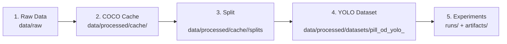

# 🏥 Healthcare AI Project — YOLO 기반 의료 이미지 객체 탐지

> AI-powered Healthcare Image Analysis System  
> Kaggle Pill Detection Competition 파이프라인 (COCO → YOLO)

---

## ✅ 프로젝트 개요
- 의료 이미지(알약) 객체 탐지 파이프라인
- COCO 어노테이션 병합 → YOLO 데이터셋 변환 → 학습/평가 → 제출
- Ultralytics YOLO 기반 (YOLOv8/YOLO11 실험 지원)

---

## 🧭 5단계 아키텍처 (데이터/산출물 흐름)
아키텍처는 **데이터가 이동하는 5개 레이어**로 정의합니다. (워크플로우 Stage 0~5와 구분)



**레이어 설명**
1) **Raw Data**: 원본 이미지/어노테이션 (수정 금지)  
2) **COCO Cache**: 병합 COCO 및 label map 저장  
3) **Split**: Train/Val 분할 결과  
4) **YOLO Dataset**: YOLO 학습용 images/labels + data.yaml  
5) **Experiments**: 학습/평가/제출 산출물

---

## 📂 프로젝트 디렉터리 구조 (Tree)
※ 숨김 폴더(.git 등)와 로컬 환경용 폴더(venv)는 생략했습니다.

```
pjt-sprint_ai07_healthcare/
├── README.md
├── requirements.txt
├── configs/
│   ├── base.yaml
│   └── experiments/
│       ├── _TEMPLATE.yaml
│       ├── exp001_baseline.yaml
│       ├── exp002_whitelist.yaml
│       ├── exp003_yolov8m.yaml
│       ├── exp004_heavy_aug.yaml
│       ├── exp005_imgsz1024.yaml
│       ├── exp006_high_conf.yaml
│       ├── exp007_final.yaml
│       ├── exp010_yolo11s.yaml
│       ├── exp012_yolo11s_1024.yaml
│       ├── exp020_stage1.yaml
│       └── exp020_stage2.yaml
├── scripts/
│   ├── 0_create_coco_format.py
│   ├── 1_splitting.py
│   ├── 2_prepare_yolo_dataset.py
│   ├── 3_train.py
│   ├── 4_evaluate.py
│   ├── 5_submission.py
│   ├── README.md
│   ├── _encoding_helper.py
│   ├── run_exp010.sh
│   └── run_train.sh
├── src/
│   └── utils.py
├── data/
│   ├── raw/                           # 필수 입력 데이터 (수정 금지)
│   │   ├── train_images/
│   │   ├── train_annotations/
│   │   └── test_images/
│   └── processed/
│       ├── cache/<run_name>/
│       │   ├── train_merged_coco.json
│       │   ├── label_map_full.json
│       │   └── splits/
│       │       ├── split_train_valid.json
│       │       ├── train_ids.txt
│       │       └── valid_ids.txt
│       └── datasets/
│           └── pill_od_yolo_<run_name>/
│               ├── data.yaml
│               ├── images/{train,val}/
│               └── labels/{train,val}/
├── runs/<run_name>/
│   ├── checkpoints/{best.pt,last.pt}
│   ├── config/{config.json,train_meta.json,paths_meta.json}
│   └── train/                          # Ultralytics 학습 출력
├── artifacts/<run_name>/
│   ├── reports/{coco_merge_stats.json,eval_results.json}
│   ├── submissions/submission.csv
│   └── plots/                          # (선택)
├── docs/
│   ├── WORKFLOW_GUIDE.md
│   └── PRIORITY2_CONFIDENCE.md
├── notebooks/
├── evaluation_results/                 # (legacy) 미사용
├── yolo11s.pt
├── yolo26n.pt
└── yolov8s.pt
```

---

## ⚙️ 설치 (사전 준비)

```bash
# 가상환경 생성 (권장)
python -m venv venv
source venv/bin/activate        # Linux/Mac
venv\Scripts\activate           # Windows

# 패키지 설치
pip install -r requirements.txt
```

---

## 🏋️ 학습 실행 (파이썬 방식)

> ⚠️ 모든 명령은 반드시 **레포 루트**(`pjt-sprint_ai07_healthcare/`)에서 실행하세요.

### 1) 스모크런 (빠른 확인, epochs=3)

```bash
python scripts/train_yolo.py --epochs 3
```

### 2) 본 학습 (예: epochs=50)

```bash
python scripts/train_yolo.py --epochs 50 --batch 8 --imgsz 640 --device 0
```

### 3) Sweep 실험 (여러 조합 자동 실행)

```bash
python scripts/sweep_train.py --epochs-list "3,10,30" --batch-list "8,16" --imgsz 640 --device 0
```

기본값:
- `--data`: `data/processed/yolo/data.yaml`
- `--model`: `yolov8s.pt`
- `--project`: `runs/detect`
- `--name auto`: `e{epochs}_b{batch}_img{imgsz}`

---

## ▶️ YOLO Export 실행 방법

### Option A: 원클릭 (Windows)

레포 루트의 `run_export_yolo.bat`를 더블클릭하면 아래 기본 설정으로 실행됩니다.

- `df`: `data/processed/df_clean.csv`
- `splits`: `data/metadata/splits.csv`
- `out`: `data/processed/yolo`
- `train-images`: `data/raw/train_images`
- `external-images`: `data/raw/external/combined/images`
- `link-mode`: `hardlink`

### Option B: 기본값으로 실행

```bash
python scripts/export_yolo.py
```

`scripts/export_yolo.py`는 레포 루트를 기준으로 동작하도록 고정되어 있어, IDE/터미널 위치 차이와 무관하게 같은 경로를 사용합니다.

### Option C: 전체 CLI 지정 (고급)

```bash
python scripts/export_yolo.py --df data/processed/df_clean.csv --splits data/metadata/splits.csv --out data/processed/yolo --train-images data/raw/train_images --external-images data/raw/external/combined/images --link-mode hardlink
```

---

## 🔄 6단계 실행 워크플로우 (Stage 0 ~ 5)

> 모든 명령은 프로젝트 루트에서 실행합니다.

### 공통 변수 (예시)
```bash
RUN="exp001"
CONFIG="configs/experiments/exp001_baseline.yaml"
```

### Stage 0: COCO 포맷 생성
```bash
python scripts/0_create_coco_format.py --run-name $RUN --config $CONFIG
```
- 출력: `data/processed/cache/<run>/train_merged_coco.json`, `label_map_full.json`

### Stage 1: 데이터 분할 (Train/Val)
```bash
python scripts/1_splitting.py --run-name $RUN --config $CONFIG
```
- 출력: `data/processed/cache/<run>/splits/` (train/valid ids)

### Stage 2: YOLO 데이터셋 준비
```bash
python scripts/2_prepare_yolo_dataset.py --run-name $RUN
# (선택) 심볼릭 링크 사용
python scripts/2_prepare_yolo_dataset.py --run-name $RUN --symlink
```
- 출력: `data/processed/datasets/pill_od_yolo_<run>/data.yaml` + images/labels

### Stage 3: 모델 학습
```bash
python scripts/3_train.py --run-name $RUN --config $CONFIG
```
- 출력: `runs/<run>/checkpoints/best.pt`, `runs/<run>/train/`

### Stage 4: 모델 평가
```bash
python scripts/4_evaluate.py --run-name $RUN --config $CONFIG
```
- 출력: `artifacts/<run>/reports/eval_results.json`, `runs/<run>/eval/`

### Stage 5: 제출 파일 생성
```bash
python scripts/5_submission.py --run-name $RUN --config $CONFIG --conf 0.25
```
- 출력: `artifacts/<run>/submissions/submission.csv`

---

## 📌 카테고리 매핑 & Bbox 포맷 주의사항

- **label map**: `data/processed/cache/<run>/label_map_full.json`
  - `id2idx`: COCO `category_id` → YOLO class index (0~N-1)
  - `idx2id`: YOLO class index → COCO `category_id`
- **YOLO 라벨(.txt)**: 정규화된 `xywh` (0~1) + class index
- **submission.csv**
  - `category_id`: **원본 COCO ID** (예: 1900, 16548)
  - `bbox_x,y,w,h`: **절대 픽셀 단위** `xywh` (정규화 아님)
  - `image_id`: 파일명 stem의 정수 (`0.png` → `0`)
  - 이미지당 **Top-4** 박스만 저장

> ⚠️ run-name이 다르면 label map이 달라질 수 있으므로 **동일 run-name**으로 Stage 0~5를 실행하세요.

---

## 📈 기대 지표 & 결과물 확인 방법

- **대회 공식 지표**: `mAP@[0.5:0.95]`
- 평가 결과: `artifacts/<run>/reports/eval_results.json`
- 학습 로그/곡선: `runs/<run>/train/` (Ultralytics 기본 출력)
- 제출 파일: `artifacts/<run>/submissions/submission.csv`

---

## 🧪 실험 설정 (Config)

- 모든 실험은 `configs/experiments/*.yaml`로 관리
- `_base_`로 `configs/base.yaml` 상속, **변경값만 override**

```yaml
# configs/experiments/exp001_baseline.yaml
_base_: "../base.yaml"
train:
  epochs: 80
  imgsz: 768
```

---

## 📚 문서
- `docs/WORKFLOW_GUIDE.md`: 단계별 실행 가이드
- `docs/PRIORITY2_CONFIDENCE.md`: Confidence threshold 전략

---

**Team Healthcare AI**
