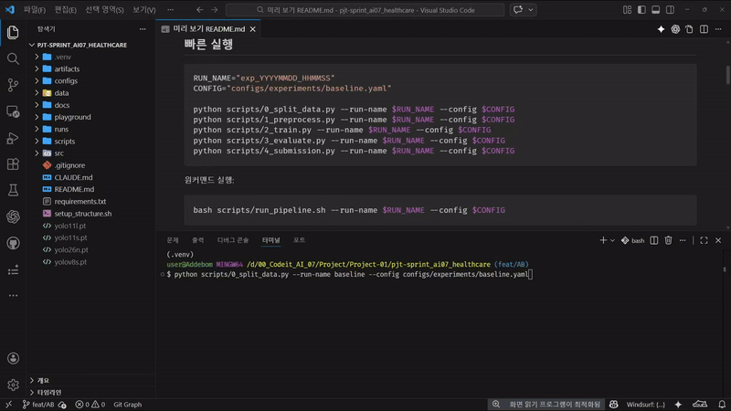
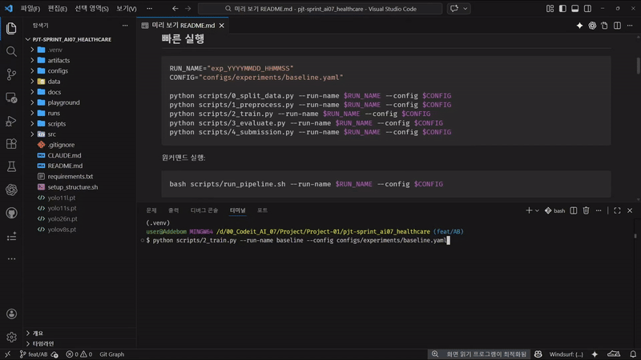
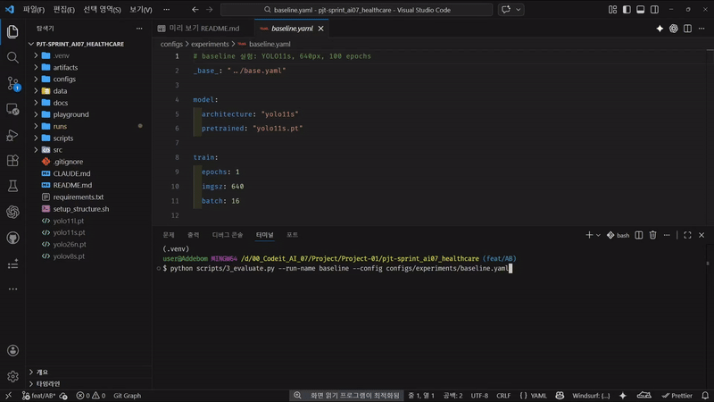
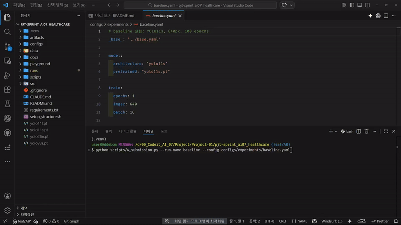

# 💊 pjt-sprint_ai07_healthcare

> 의료 이미지 내 약(Pill) 객체를 탐지하기 위한 Object Detection 파이프라인 프로젝트

[](https://www.python.org/)
[](https://pytorch.org/)
[](https://github.com/ultralytics/ultralytics)
### 🔗 Project Links
- [📌 프로젝트 홈페이지](https://www.notion.so/sprint-ai07-healthcare/Healthcare-Project-0787fcf828e6834da8f40130b654fa4c)
- [📝 협업 일지](https://sprint-ai07-healthcare.notion.site/Logs-2f57fcf828e6809b8a21cef0cc5df8a0?source=copy_link)

---

## 📌 Project Overview

**Task:** Object Detection for Medical Pill Images  
**Goal:** 재현 가능한 파이프라인으로 약 객체의 정확한 위치 및 클래스 예측

- **Model:** YOLO-based Detector (YOLOv8m)
- **Framework:** PyTorch / Ultralytics
- **Key Feature:** STAGE 0~4 표준 파이프라인 + `competition_best.pt` 우선 선택 + 제출 검증 자동화
- **Focus:** 대회 지표 `mAP75_95` 중심으로 데이터 전처리부터 학습·평가·제출까지 전 과정 추적

본 프로젝트는 **재현 가능한 데이터 처리, 안정적인 학습/평가, 제출 산출물의 일관된 관리**를 목표로 설계되었습니다.

---

## 📊 Project Summary

| 항목 | 내용 |
|------|------|
| **프로젝트명** | Healthcare Pill Detection |
| **목표** | 모바일 촬영 알약 이미지에서 최대 4개 객체 검출 |
| **데이터셋** | Raw 총 14,244장 (내부 232 + External 14,012), 정제 후 학습 이미지 10,226장 / 박스 39,226개 |
| **클래스 수** | 학습 118개 클래스(통합 기준), 제출 필터 실험 74개 카테고리 |
| **최종 모델** | YOLOv8m 고해상도 파인튜닝 + 제출 후처리 튜닝 |
|  **최종 성능** | Public Score 0.99524 (최종 제출본 2) |
|  **초기 모델 대비 개선(상대)** | +10.52% (`0.90052 → 0.99524`) |
|  **Baseline 대비 개선(절대)** | +0.03386p (`0.96138 → 0.99524`) |
|  **최종 제출 품질** | `3,229행 / 842장 / 이미지당 최대 4박스 준수 / 제출 검증 PASS(에러 0)` |
|  **핵심 기법** | `exclude_4444_208` + external 매핑 + 고해상도/rect + `conf=0.10`, `min-conf=0.24`, 74카테고리 필터 |
| **개발 기간** | 2026.01.29 - 2026.02.13 |
| **팀 구성** | 5인 (PM, Data Engineer, Model Architect 등) |

---

## 📈 Results ⭐⭐⭐⭐⭐

### Performance Metrics

| 단계 | 모델 | 핵심 기법 | mAP@0.5 | mAP@0.5:0.95 | Epoch | Public Score | 개선 폭 |
|------|------|-----------|---------|--------------|-------|--------------|---------|
| [변경:R-13] v0 First Model | YOLOv8n | 초기 E2E 검증 | - | - | - | **0.90052** | - |
| [변경:R-13] v1 Baseline Model | YOLOv8s | 파이프라인 baseline 확정 | - | - | - | **0.96138** | +0.06086p |
| [변경:R-13] v2 (Baseline 개선 1차) | YOLOv8m | 데이터 정제 + 튜닝 | - | **0.95200** | - | **0.96859** | +0.00721p |
| [변경:R-13] v3 (개선 2차) | YOLOv8m | external 통합 + `exclude_4444_208` 적용 | - | **0.98682** | 49 | **0.99361** | +0.02502p |
| [변경:R-13] v4 (최종 제출본 1) | YOLOv8m | 고해상도/rect + 제출 후처리 | **0.98937** | **0.98615** | 48(최고점) | **0.99402** | +0.00041p |
| [변경:R-13] **v5 (최종 제출본 2)** | **YOLOv8m** | **하드케이스 보강 + 저신뢰 구간 보정(`swap109_q10`)** | **미기록** | **미기록** | **미기록** | **0.99524** | **+0.00122p** |

### Key Improvements

  **[변경:R-13] 점수 개선 흐름:** `0.90052 -> 0.96138 -> 0.96859 -> 0.99361 -> 0.99402 -> 0.99524`
- **핵심 평가 지표:** `mAP75_95`를 대회 기준 핵심 지표로 사용하고, `mAP50`, `mAP50_95`는 보조 지표로 함께 추적
- **가중치 선택 전략:** STAGE 2에서 `best.pt`/`last.pt`를 재평가해 `competition_best.pt`를 생성하고, STAGE 3/4에서 우선 사용
- **제출 후처리 기준값 고정:** `conf=0.10`, `min-conf=0.24`, category filter(74), image당 top-4
- **최종 제출 품질 지표:** `3,229행`, `842 이미지`, 제출 검증 `PASS`, 포맷 오류 `0건`

📊 **전체 실험 로그:** [runs/_registry.csv](runs/_registry.csv)  
📄 **상세 분석:** [docs/02_experiments.md](docs/02_experiments.md)

---

## 🧪 Experiment Demo

🔍 Stage별 실험 작동 데모

| Stage |  Demo - 동작 설명  |
|------|------|
| **Stage 0** |  |
| 0 단계 | 데이터 정제/검증/분할 + COCO 재조립 |
| **Stage 1** |  |
| 1 단계 | YOLO 학습용 데이터셋 변환 + 라벨 검증 |
| **Stage 2** |  |
| 2 단계 | 모델 학습 + `competition_best.pt` 선택 |
| **Stage 3**  |  |
| 3 단계 | 검증셋 평가 + `metrics.json` 업데이트  |
| **Stage 4** |  |
| 4 단계 | 테스트 추론 + 제출 CSV/manifest 생성 |

### 원커맨드 파이프라인 실행 데모

| Run Pipeline |
|------|
|  |

---

## 👥 Team & Contributions 

| Member | ▶ Lead Role </br> ▷ Sub Role | Key Contributions |
| :------: | ------  | ------ | 
|[ <br/> @ming2tofu33](https://github.com/ming2tofu33) </br> **김도민** | ▶ *Project Manager* </br> ▷ *Model Architect* | - 온라인 협업 팀 리드 /  프로젝트 관련 모든 일정 계획 및 관리 / 관련 문서 체계화 (Notion, Discord 활용) </br>- Git Flow & Project Structure 관리<br>- YOLOv8s Baseline Model 설계 <br>- 실험 자동화 파이프라인 구축 |
| [ <br/> @UntitledPlayerOne](https://github.com/UntitledPlayerOne) </br> **김준혁** | ▶ *Experimentation Lead* </br> ▷ *Data Engineer* | - 이미지 전처리 및 추가 데이터 정제 </br>- 데이터 파이프라인 구축 및 모델 이식 </br>- 기준 제출 간 bbox/score 하이브리드 스윕 전략 설계 및 검증 </br>- 하이퍼파라미터 튜닝 및 Kaggle 제출 관리|
| [ <br/> @sje0221](https://github.com/sje0221) </br> **서지은** | ▶ *Documentation Lead* </br> ▷ *Presentation Lead* | - Baseline Model STAGE 별 기능 및 동작 확인 </br>- 팀 문서 컨펌 및 초기 모델 실험 구현 지원 </br>- 모델 개선 양상 test run & 재현성 체크 </br>- 실험 데이터 및 산출물 체계 정립 / 프로젝트 워크플로우 문서화 총괄 |
| [ <br/> @addebom](https://github.com/addebom) </br> **안뜰에봄** | ▶ *Data Engineer* </br> ▷ *Experimentation Lead* |- 원본 + 외부 통합 데이터 전처리 전략 관리 </br>- 데이터 통합 시 JSON 정규식 파싱을 통한 라벨링 매핑 오류 발견 및 해결 <br>- YOLOv11 최적화 다중 객체 전용 로더 구축<br>- 외부 데이터 리스크 관리 및 롤백<br>|
| [ <br/> @geonhoa3](https://github.com/geonhoa3) </br> **이건호** | ▶ *Presentation Lead* </br> ▷ *Model Architect* | - 최종 발표 자료 제작 및 프로젝트 성과 정리·공유  </br>- Baseline Model 아키텍처 개선을 통한 성능 고도화 </br>- 팀 회의록 작성 및 협업 커뮤니케이션 관리 </br>- 최종 보고서 작성 지원 및 프로젝트 산출물 정리|

---

## 💡 Approach & Strategy

### 1. 문제 분석

- **데이터 특성**: 모바일 촬영으로 조명/각도 변화 심함, 작은 객체(< 50px) 다수
- **클래스 불균형**: 상위 10개 클래스가 전체의 60% 차지 → 소수 클래스 학습 부족
- **과제**: 최대 4개 검출 제한 → NMS 임계값 최적화 필요

### 2. 핵심 전략

1. **STAGE 0~1 데이터 정합성 강화**: `exclude_4444_208.txt` 기반 수동 제외 + external 매핑/정제 + YOLO 포맷 변환 표준화
2. **STAGE 2~3 모델 선택 안정화**: `competition_select`로 `competition_best.pt`를 생성해 검증/제출에 일관 적용
3. **STAGE 4 제출 후처리 표준화**: `conf`, `min-conf`, `NMS IoU`, `Top-k`, category 필터를 명시적으로 관리

### 3. 실험 과정 요약

```
v0 : First Model Public 0.90052
  ↓ -
v1: Baseline Model Public 0.96859
  ↓ external 통합 + exclude_4444_208
v2 Public 0.99361
  ↓ 고해상도/rect + 후처리 튜닝
v3 Public 0.99402
  ↓ 하드케이스 보강 + 저신뢰 구간 보정
v4 Public 0.99524
```


📄 **상세 실험 과정:** [docs/02_experiments.md](docs/02_experiments.md)

---

## 🔍 Key Improvements & Lessons Learned

### ✅ 성능 향상 요인

#### 1. 대회 지표 중심 추적 체계
- **방법**: STAGE 2/3에서 `mAP75_95`를 핵심 지표로 기록하고 `runs/_registry.csv`에 누적 관리
- **효과**: 실험 간 비교 기준을 단일화하여 모델 선택 의사결정 단순화

#### 2. 데이터 정합성 강화
- **방법**: `exclude_4444_208` 적용, external 데이터 category 매핑, STAGE 0/1의 표준화된 정제-변환
- **효과**: 잘못된 라벨/중복/불일치 데이터 유입을 줄여 제출 안정성 향상

#### 3. 제출 품질 관리 자동화
- **방법**: `competition_best.pt` 우선 선택, 후처리 파라미터(`conf/min-conf/iou/topk`) 표준화
- **효과**: 제출 포맷 오류를 줄이고 점수 개선 실험을 반복 가능하게 운영

---

### ❌ 시도했으나 효과 없었던 것

#### 1. 과도한 합성 증강
- **관찰**: 도메인 특성과 맞지 않는 강한 증강은 bbox 품질과 일반화에 불리할 수 있음
- **결론**: 고해상도/rect 기반의 안정적 파인튜닝과 보수적 후처리 조합이 더 일관적

#### 2. 과도한 모델 복잡도 증가
- **관찰**: 복잡도 상승 대비 점수 향상이 제한적일 수 있음
- **결론**: 현재는 파이프라인 정합성/실험 재현성 개선이 성능 개선에 더 직접적

---

## 🛠️ Tech Stack

| 분류 | 기술 |
|------|------|
| **Framework** | PyTorch 2.5.1 + Ultralytics 8.4.12 |
| **Model Family** | YOLOv8 / YOLO11 실험 |
| **Data Processing** | Pandas, Polars, OpenCV, Albumentations |
| **Experiment Tracking** | `runs/_registry.csv`, `metrics.json`, `config_resolved.yaml` |
| **Visualization** | Matplotlib, Seaborn |

---

## 🖥️ Environment Setup 

### System Requirements

- **Python**: 3.11.9
- **GPU**: NVIDIA RTX 3090 (24GB VRAM) 권장
- **CUDA**: 12.1
- **OS**: Ubuntu 20.04 / Windows 10+ (WSL2)

### Installation

```bash
# 1. Repository Clone
git clone https://github.com/ming2tofu33/pjt-sprint_ai07_healthcare.git
cd pjt-sprint_ai07_healthcare
git checkout develop

# 2. 가상환경 생성 및 활성화
python -m venv venv

# Windows
venv\Scripts\activate

# Linux/Mac
source venv/bin/activate

# 3. 의존성 설치
pip install -r requirements.txt
```

**⚠️ 주의사항:**
- CUDA/PyTorch 버전 충돌 주의 → `requirements.txt` 버전 확인
- GPU 메모리 부족 시 `batch_size` 조정 필요

---

## 🚀 Quick Start

### Step-by-Step Execution

```bash
# 실험 이름 및 설정 파일 지정
RUN_NAME="exp_$(date +%Y%m%d_%H%M%S)"
CONFIG="configs/experiments/baseline.yaml"

# 단계별 실행
python scripts/0_split_data.py --run-name $RUN_NAME --config $CONFIG
python scripts/1_preprocess.py --run-name $RUN_NAME --config $CONFIG
python scripts/2_train.py --run-name $RUN_NAME --config $CONFIG
python scripts/3_evaluate.py --run-name $RUN_NAME --config $CONFIG
python scripts/4_submission.py --run-name $RUN_NAME --config $CONFIG
```

### One-Command Execution

```bash
# 전체 파이프라인 한 번에 실행
bash scripts/run_pipeline.sh --run-name $RUN_NAME --config $CONFIG
```

### 실험 설정 예시

| Config File | Description | Use Case |
|-------------|-------------|----------|
| `configs/experiments/baseline.yaml` | 공통 baseline 템플릿 | 빠른 파이프라인 검증 |
| `configs/experiments/yolov8s_baseline.yaml` | YOLOv8s baseline 학습 | 단일 모델 기준선 확보 |
| `configs/experiments/yolo11m_ext_balanced_v1.yaml` | YOLO11m + external 통합 실험 | 성능 비교 실험 |
| `configs/experiments/yolov8s_hSV_v2.yaml` | HSV 튜닝 실험 | 데이터 증강 계열 비교 |

📄 **상세 설정 가이드:** [docs/02_experiments.md](docs/02_experiments.md)

---

## 📁 Project Structure

```
pjt-sprint_ai07_healthcare/
├── configs/                   # 실험 설정 (YAML)
│   ├── base.yaml              # 공통 기본 설정
│   └── experiments/           # 실험별 설정
│
├── data/                      # 데이터셋 (Git 제외)
│   ├── raw/                   # 원본 데이터 (읽기 전용)
│   └── processed/             # 전처리 결과
│
├── src/                       # 소스 코드
│   ├── dataprep/              # 데이터 전처리, 증강
│   ├── models/                # 모델 정의
│   ├── engine/                # 학습/평가 엔진
│   ├── inference/             # 추론 및 제출 파일 생성
│   └── utils/                 # 공통 유틸리티
│
├── scripts/                   # 실행 스크립트
│   ├── 0_split_data.py        # 데이터 분할
│   ├── 1_preprocess.py        # 전처리
│   ├── 2_train.py             # 학습
│   ├── 3_evaluate.py          # 평가
│   ├── 4_submission.py        # 제출 파일 생성
│   └── run_pipeline.sh        # 전체 파이프라인 실행
│
├── runs/                      # 실험 결과 (Git 제외)
│   ├── exp_*/                 # 실험별 디렉토리
│   └── _registry.csv          # 실험 이력 요약
│
├── artifacts/                 # 최종 산출물 (Git 제외)
│   ├── best_models/           # 베스트 가중치
│   └── submissions/           # 제출 CSV
│
└── docs/                      # 문서
```

📄 **자세한 구조 설명:** [docs/00_quickstart.md](docs/00_quickstart.md)

---

## ⚙️ Operating Principles

우리 팀은 **재현성 · 일관성 · 추적 가능성**을 위해 다음 원칙을 따릅니다:

1. **`data/raw/`는 읽기 전용으로 관리**  
   → 원본 데이터 보호, 전처리는 `data/processed/`에 저장

2. **실험 변경은 `configs/experiments/*.yaml`에서만 수행**  
   → 모든 실험 설정을 버전 관리하여 재현 보장

3. **병합된 최종 설정은 `runs/<exp>/config_resolved.yaml`에 저장**  
   → base + experiment config 병합 결과 자동 저장

4. **실험 결과는 `runs/_registry.csv`로 중앙 관리**  
   → 모든 실험의 메트릭을 한 곳에서 비교 가능

5. **Random Seed 고정 (42)**  
   → 동일 설정으로 동일 결과 재현 보장

📄 **상세 운영 가이드:** [docs/00_quickstart.md](docs/00_quickstart.md)

---

## 🧪 Experiment Management 

### 실험 자동 기록

모든 실험은 자동으로 기록되며, 다음 위치에 저장됩니다:

- **실험 설정**: `runs/<run_name>/config_resolved.yaml`
- **학습 결과**: `runs/<run_name>/train/` (`compact`) 또는 `runs/<run_name>/` (`legacy`)
- **평가 결과**: `runs/<run_name>/eval/val/` + `runs/<run_name>/metrics.json`
- **제출 파일**: `artifacts/submissions/*.csv`, `runs/<run_name>/submit/` (`compact`)

### 실험 비교

```bash
# 전체 실험 요약 확인
type runs\\_registry.csv   # Windows
# cat runs/_registry.csv   # Linux/Mac
```

📊 **전체 실험 요약**: [runs/_registry.csv](runs/_registry.csv)  
📄 **실험 관리 가이드**: [docs/02_experiments.md](docs/02_experiments.md)

---

**[내부 참고]** Mode 옵션 (일반 사용자는 무시 가능)

<details>
<summary>클릭하여 펼치기</summary>

| Mode | STAGE 2 Output | STAGE 4 Output |
|------|----------------|----------------|
| `compact` (default) | `runs/<run_name>/train/` | `runs/<run_name>/submit/debug/`, `runs/<run_name>/submit/submission_manifest.json` |
| `legacy` | `runs/<run_name>/` | `runs/<run_name>/submission_debug/`, `runs/<run_name>/submission_manifest.json` |

일반적으로 default 모드 사용을 권장합니다.

</details>

---

## 🎓 Lessons Learned ⭐⭐⭐

본 프로젝트를 통해 배운 점:

-  **재현 가능한 자동화 파이프라인의 가치**: STAGE 0~4 표준화로 실험 비교/원인 추적이 쉬워짐
-  **데이터 정합성의 영향력**: `exclude_4444_208` + external 매핑 정제가 성능 안정화에 직접 기여
-  **보수적 후처리의 실효성**: `min-conf`, top-k, category filter를 고정했을 때 제출 품질이 안정적
-  **운영상의 교훈**: Public 리더보드 기준 의사결정은 빠르지만, Private 변동 리스크를 항상 동반

📝 **상세 회고**: [docs/03_retrospective.md](docs/03_retrospective.md) & [팀 블로그](https://sprint-ai07-healthcare.notion.site/Team-Venvoo-3067fcf828e680bdac30dd97346eba62)

---

## 📌 Conclusion ⭐⭐⭐⭐⭐

본 프로젝트를 통해 다음을 달성했습니다:

- ✅ **재현 가능한 데이터 파이프라인 구축** (STAGE 0~4, 설정 병합 기록, 산출물 분리 저장)
- ✅ **모델 성능 개선 달성**: `0.90052 -> 0.99524` (상대 `+10.52%`, Baseline 대비 `+0.03386p`)
- ✅ **제출 안정성 확보**: `3,229행`, `842장`, image당 max 4, 제출 검증 `PASS`
- ✅ **운영 가능한 선택 전략 구축**: `competition_best.pt` 우선 선택 + 후처리 기준값 고정

### 향후 개선 방향

- Public 중심 의사결정 편향을 줄이기 위한 검증 전략 고도화
- 하드케이스 보강으로 인한 클래스 편향 리스크 모니터링 체계 구축
- 고해상도(`imgsz=1280`)·rect 설정의 비용 대비 효율 최적화

---

## 📚 References

- [Ultralytics YOLOv8 Documentation](https://docs.ultralytics.com/)
- [YOLOv8 Paper: "YOLOv8: A Real-Time Object Detection System"](https://arxiv.org/)
- [PyTorch Official Documentation](https://pytorch.org/docs/stable/index.html)
- [COCO Dataset](https://cocodataset.org/)

---

## 🙏 Acknowledgments 

- **Dataset**: Kaggle 비공식 대회
- **Pretrained Model**: [Ultralytics YOLO](https://github.com/ultralytics/ultralytics)
- **Mentor**: [Jinyong Shin](https://github.com/jinyongshin) - 프로젝트 방향 설정 및 기술 자문
- **Team Members**: 협업과 코드 리뷰에 감사드립니다.

---

## 📞 Contact 

- **Email**: ming2tofu33@gmail.com
- **Blog**: [프로젝트 페이지](https://www.notion.so/sprint-ai07-healthcare/Healthcare-Project-0787fcf828e6834da8f40130b654fa4c)
- **GitHub**:
  
<div align="center">

| **김도민** | **김준혁** | **서지은** | **안뜰에봄** | **이건호** |
| :------: |  :------: |  :------: |  :------: |  :------: |
| [ <br/> @ming2tofu33](https://github.com/ming2tofu33) | [ <br/> @UntitledPlayerOne](https://github.com/UntitledPlayerOne) | [ <br/> @sje0221](https://github.com/sje0221) | [ <br/> @addebom](https://github.com/addebom) | [ <br/> @geonhoa3](https://github.com/geonhoa3) |

</div>

---

## 📖 Documentation

| 문서 | 내용 |
|------|------|
| [Project Notion Home](https://www.notion.so/sprint-ai07-healthcare/Healthcare-Project-0787fcf828e6834da8f40130b654fa4c) | 프로젝트 전체 문서 허브(기획/실험/산출물) |
| [Collaboration Logs](https://sprint-ai07-healthcare.notion.site/Logs-2f57fcf828e6809b8a21cef0cc5df8a0?source=copy_link) | 일자별 협업 로그 및 의사결정 기록 |
| [00_quickstart.md](docs/00_quickstart.md) | 프로젝트 시작 가이드 |
| [01_data_pipeline.md](docs/01_data_pipeline.md) | 데이터 처리 파이프라인 상세 |
| [02_experiments.md](docs/02_experiments.md) | 실험 관리 및 설정 가이드 |
| [docs/03_retrospective.md](docs/03_retrospective.md) | 프로젝트 회고 및 인사이트 |

---
